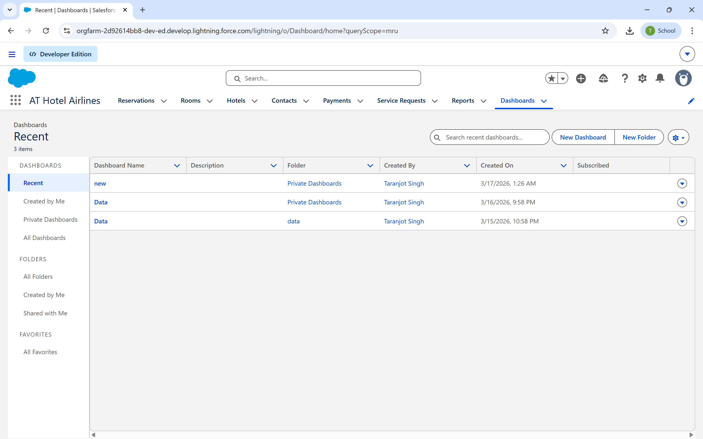
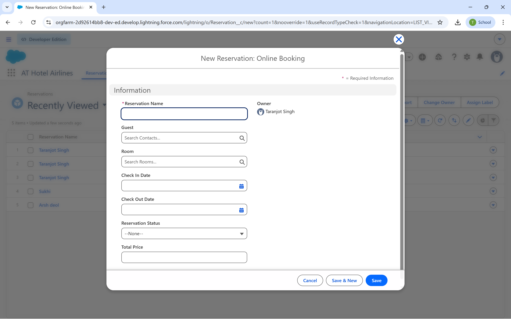

# 🏨 Hotel Management System (Salesforce CRM)

🚀 A Salesforce-based CRM application designed to automate hotel operations including reservations, room management, payments, and guest service requests using low-code automation.

---

## 📌 Overview

The Hotel Management System is built on the Salesforce Lightning Platform to streamline hotel operations. It replaces manual processes with automated workflows, improving efficiency, data accuracy, and real-time tracking.

---

## ✨ Key Features

- 🏢 **Custom Objects**: Hotels, Rooms, Reservations, Payments, Service Requests, Contacts  
- 🔄 **Screen Flow**: Automated reservation booking interface  
- ⚡ **Record-Triggered Flow**: Real-time room status updates (Available → Booked)  
- ✅ **Validation Rules**: Prevent incorrect bookings (date validation, required fields)  
- 🔗 **Object Relationships**: Structured data linking across modules  
- 🔐 **Data Security**: Role-based access using OWD, Profiles, and Field-Level Security  
- 📊 **Reports & Dashboards**: Real-time insights into operations and revenue  

---

## 🛠️ Tech Stack

| Category       | Technology |
|----------------|-----------|
| Platform       | Salesforce Lightning |
| Automation     | Flow Builder (Screen Flow, Record-Triggered Flow) |
| Database       | Custom Objects & Relationships |
| Security       | OWD, Profiles, Field-Level Security |
| Analytics      | Reports & Dashboards |

---

## 🧠 System Architecture

Hotel
↓
Rooms
↓
Reservations
↓
Payments

Contact (Guest)
↓
Reservations
↓
Service Requests

---

## ⚙️ Core Functionalities

### 🔹 Reservation Booking (Screen Flow)
- Select guest and room
- Enter check-in and check-out dates
- Automatically creates reservation record

### 🔹 Room Status Automation
- Reservation created → Room marked as **Booked**
- Ensures real-time room availability tracking

### 🔹 Data Validation
- Prevents invalid entries (e.g., check-out before check-in)
- Ensures consistent and reliable data

### 🔹 Role-Based Access
- Secure data using profiles and permissions
- Controlled visibility across users

---

## 📊 Reports & Dashboards

### Reports
- Reservation Status Report  
- Room Availability Report  
- Payment Tracking Report  
- Service Request Report  

### Dashboards
- Reservations by Status  
- Room Availability Overview  
- Revenue Insights  
- Service Requests Monitoring  

---

## 📸 Screenshots

### Dashboard

### Reservations

### Rooms

### Hotels

### Payments

### Service Requests

### Create Reservation

---

## 📄 Project Report

📘 [View Full Project Report](Hotel-Management-System-Report.pdf)

---

## 🎯 Use Case

This system simulates a real-world hotel CRM used to:
- Manage bookings efficiently  
- Track room availability in real-time  
- Handle guest service requests  
- Monitor payments and revenue  

---

## 🚀 Future Enhancements

- Online booking integration  
- Mobile application support  
- AI-based demand prediction  
- Payment gateway integration  

---

## 👨‍💻 Author

**Taranjot Singh**  
🔗 GitHub: https://github.com/Taranjot13  
🔗 LinkedIn: (Add your LinkedIn link)

---

## ⭐ Note

This project was developed using Salesforce Developer Edition and demonstrates enterprise-level CRM automation using a low-code platform.
